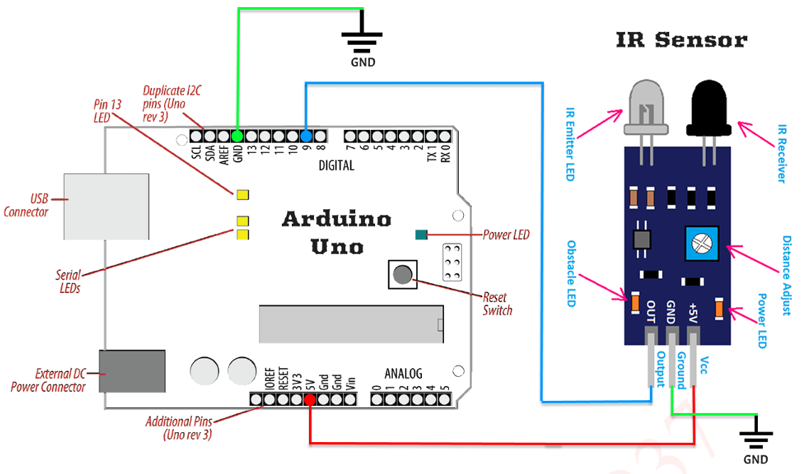

<h1 align="center">
  
  Go Programming & IOT Slips
  
</h1>

<h3 align="center"><b>Savitribai Phule Pune University</b></h3>
<div align="center" style="margin: 15px 0;">
  
</div>

<p align="center">
  T.Y. B.C.A. (Science) <br>
  Semester VI - Practical Examination<br>
  <b>BCA 367: DSE V Lab (Programming in GO and IoT)</b>
</p>

<p align="center">
  🐹 Go Language &nbsp;&nbsp;•&nbsp;&nbsp; 🔧 Arduino C++ &nbsp;&nbsp;•&nbsp;&nbsp; 📡 IOT Systems
</p>

---

## 📋 Index

| Slip | Q1 (20 Marks) | Q2 (20 Marks) |
|------|--------------|--------------|
| [Slip 01](#slip-01) | Arithmetic Operations using Switch | Student Details using Structure |
| [Slip 02](#slip-02) | Fibonacci Series of N Terms | File Information |
| [Slip 03](#slip-03) | Palindrome Check using Function | Employee with Maximum Salary |
| [Slip 04](#slip-04) | Recursive Sum of Digits | Sort Array in Ascending Order |
| [Slip 05](#slip-05) | Create Text File and Write | Employee with Minimum Salary |
| [Slip 06](#slip-06) | Matrix Multiplication | Copy Array Elements using Method |
| [Slip 07](#slip-07) | Matrix Transpose | Struct with Pointer Receiver Method |
| [Slip 08](#slip-08) | Book Details using Structure | Interface with Circle & Rectangle |
| [Slip 09](#slip-09) | Palindrome Check using Function | Interface with Square & Rectangle (Volume) |
| [Slip 10](#slip-10) | Type Assertion with Interface | Fibonacci Series using Channel |
| [Slip 11](#slip-11) | Two Digit Number Check | Buffered Channel - Capacity & Length |
| [Slip 12](#slip-12) | Swap Two Numbers (Call by Reference) | Even/Odd using Goroutines & Channels |
| [Slip 13](#slip-13) | Sum of Even and Odd Numbers (1–100) | Benchmark for Square Function |
| [Slip 14](#slip-14) | Slice Operations (append, remove, copy) | Sum of Squares & Cubes using Goroutines |
| [Slip 15](#slip-15) | Function Returning Multiple Values | Read XML File into Structure |
| [Slip 16](#slip-16) | User-Defined Package for Rectangle Area | Print Numbers 0–10 with Random Delay |
| [Slip 17](#slip-17) | Function Returning Multiple Values (ASMD) | Append Content to Text File |
| [Slip 18](#slip-18) | Multiplication Table using Function | User-Defined Package Calculator |
| [Slip 19](#slip-19) | Function Returning Add & Subtract | Open File in Read-Only Mode |
| [Slip 20](#slip-20) | Append Content to Text File | Channel - Close using For Range Loop |

---

---

<h2 align="center" id="slip-01"><b> Slip 01 </b></h2>

### Q1. Write a program in GO language to accept user choice and print answers using arithmetic operators. [10 Marks]

#### ⚙️ `main.go`

```go
package main

import "fmt"

func main() {
	var a, b, ch int
	fmt.Print("Enter a: ")
	fmt.Scan(&a)
	fmt.Print("Enter b: ")
	fmt.Scan(&b)
	fmt.Print("1. Addition\n2. Subtraction\n3. Multiplication\n4. Division\nEnter your choice: ")
	fmt.Scan(&ch)

	switch ch {
	case 1:
		fmt.Printf("Addition = %d\n", a+b)
	case 2:
		fmt.Printf("Subtraction = %d\n", a-b)
	case 3:
		fmt.Printf("Multiplication = %d\n", a*b)
	case 4:
		if b == 0 {
			fmt.Println("Division by zero not allowed\n")
		} else {
			fmt.Printf("Division = %d\n", a/b)
		}
	default:
		fmt.Println("Invalid choice\n")
	}
}
```

---

### Q2. Write a program in GO language to accept n student details like roll_no, stud_name, mark1, mark2, mark3. Calculate the total and average of marks using structure. [20 Marks]

#### ⚙️ `main.go`

```go
package main

import "fmt"

type Student struct {
	rollNo     int
	name       string
	m1, m2, m3 int
	total      int
	avg        float64
}

func main() {
	var n int
	fmt.Print("Enter number of students: ")
	fmt.Scan(&n)

	var s [50]Student

	for i := 0; i < n; i++ {
		fmt.Printf("\nEnter Roll No: ")
		fmt.Scan(&s[i].rollNo)
		fmt.Printf("Enter Name: ")
		fmt.Scan(&s[i].name)
		fmt.Printf("Enter Mark1 Mark2 Mark3: ")
		fmt.Scan(&s[i].m1, &s[i].m2, &s[i].m3)
		s[i].total = s[i].m1 + s[i].m2 + s[i].m3
		s[i].avg = float64(s[i].total) / 3
	}

	fmt.Println("\nRollNo\tName\tTotal\tAverage")
	for i := 0; i < n; i++ {
		fmt.Printf("%d\t%s\t%d\t%.2f\n", s[i].rollNo, s[i].name, s[i].total, s[i].avg)
	}
}
```

---

### Q3. Embedded Systems – Arduino [ 10 Marks]

#### a) Block Diagram / Pin Diagram – Arduino Uno with IR Sensor



#### b) WAP in C++ language to blink LED.

```cpp
// Define LED pin
const int ledPin = 10;

void setup() {
  pinMode(ledPin, OUTPUT); // Set LED pin as output
}

void loop() {
  digitalWrite(ledPin, HIGH); // Turn LED ON
  delay(1000);                // Wait for 1 second
  digitalWrite(ledPin, LOW);  // Turn LED OFF
  delay(1000);                // Wait for 1 second
}
```

#### c) Observations on Input and Output

**Input:**
No external input device is required. The Arduino executes the uploaded program automatically after power is supplied through USB or an external power source.

**Output:**
The LED connected to digital pin 10 blinks continuously. It turns ON for 1 second and OFF for 1 second, creating a repeating blinking pattern.

#### d) Result and Conclusion

**Result:**
The LED connected to digital pin 10 successfully blinked with a 1-second ON and 1-second OFF interval. This confirms that the Arduino Uno board executed the uploaded C++ program correctly.

**Conclusion:**
The experiment demonstrates the basic digital output operation of the Arduino Uno using the `pinMode()` and `digitalWrite()` functions. By controlling the HIGH and LOW states of a digital pin, an LED can be switched ON and OFF. This concept forms the foundation for controlling other electronic components such as buzzers, relays, motors, and sensors in embedded and IoT applications.

---

---

<h2 align="center" id="slip-02"><b> Slip 02 </b></h2>

### Q1. Write a program in GO language to print Fibonacci series of n terms. [10 Marks]

#### ⚙️ `main.go`

```go
package main

import "fmt"

func main() {
	var n int
	fmt.Print("Enter number of terms: ")
	fmt.Scan(&n)

	a, b := 0, 1
	fmt.Println("Fibonacci Series:")
	for i := 1; i <= n; i++ {
		fmt.Print(a, " ")
		a, b = b, a+b
	}
}
```

---

### Q2. Write a program in GO language to print file information. [20 Marks]

#### ⚙️ `main.go`

```go
package main

import (
	"fmt"
	"os"
)

func main() {
	var fname string
	fmt.Print("Enter file name: ")
	fmt.Scan(&fname)

	info, err := os.Stat(fname)
	if err != nil {
		fmt.Println("Error:", err)
		return
	}

	fmt.Println("\n--- File Information ---")
	fmt.Println("File Name:", info.Name())
	fmt.Println("File Size:", info.Size(), "bytes")
	fmt.Println("Permissions:", info.Mode())
	fmt.Println("Last Modified:", info.ModTime())
	fmt.Println("Is Directory:", info.IsDir())
}
```

---

### Q3. Embedded Systems – Arduino [ 10 Marks]

#### a) Block Diagram / Pin Diagram – Arduino Uno with IR Sensor


#### b) WAP in C++ language to turn ON/OFF buzzer.

```cpp
// Define buzzer pin
const int buzzer = 9;

void setup() {
  pinMode(buzzer, OUTPUT); // Set buzzer pin as output
}

void loop() {
  digitalWrite(buzzer, HIGH); // Turn ON buzzer
  delay(1000);                // Wait for 1 second
  digitalWrite(buzzer, LOW);  // Turn OFF buzzer
  delay(1000);                // Wait for 1 second
}
```

#### c) Observations on Input and Output

**Input:**
No external input device is required. The Arduino executes the uploaded program automatically after power is supplied through USB or an external power source.

**Output:**
- The buzzer connected to pin 9 turns ON and produces sound.
- After 1 second, the buzzer turns OFF and stops producing sound.
- This ON and OFF cycle repeats continuously with a delay of 1 second.

#### d) Result and Conclusion

**Result:**
The buzzer successfully turned ON and OFF at a 1-second interval, confirming that the Arduino Uno executed the program correctly and controlled the digital output pin as expected.

**Conclusion:**
This experiment demonstrates how the Arduino Uno can control an output device such as a buzzer using digital signals through the `pinMode()` and `digitalWrite()` functions. The same concept can be applied to control other electronic components such as LEDs, relays, motors, and alarms in embedded and IoT applications.

---

---

<h2 align="center" id="slip-03"><b> Slip 03 </b></h2>

### Q1. Write a program in the GO language using function to check whether accepted number is palindrome or not. [10 Marks]

#### ⚙️ `main.go`

```go
package main

import "fmt"

func isPalindrome(n int) bool {
	original := n
	rev := 0
	for n > 0 {
		rev = rev*10 + n%10
		n /= 10
	}
	return original == rev
}

func main() {
	var num int
	fmt.Print("Enter a number: ")
	fmt.Scanln(&num)

	if isPalindrome(num) {
		fmt.Println("The number is a palindrome.")
	} else {
		fmt.Println("The number is not a palindrome.")
	}
}
```

---

### Q2. Write a Program in GO language to accept n records of employee information (eno, ename, salary) and display record of employees having maximum salary. [20 Marks]

#### ⚙️ `main.go`

```go
package main

import "fmt"

type Employee struct {
	eno    int
	ename  string
	salary float64
}

func main() {
	var n int
	fmt.Print("Enter number of employees: ")
	fmt.Scan(&n)

	E := make([]Employee, n)

	for i := 0; i < n; i++ {
		fmt.Println("\nEnter details of employee", i+1)
		fmt.Print("Employee No: ")
		fmt.Scan(&E[i].eno)
		fmt.Print("Employee Name: ")
		fmt.Scan(&E[i].ename)
		fmt.Print("Salary: ")
		fmt.Scan(&E[i].salary)
	}

	maxSalary := E[0].salary
	for i := 1; i < n; i++ {
		if E[i].salary > maxSalary {
			maxSalary = E[i].salary
		}
	}

	fmt.Println("\n--- Employee(s) with Maximum Salary ---")
	for i := 0; i < n; i++ {
		if E[i].salary == maxSalary {
			fmt.Println("Employee No:", E[i].eno)
			fmt.Println("Employee Name:", E[i].ename)
			fmt.Println("Salary:", E[i].salary)
			fmt.Println("-------------------------")
		}
	}
}
```

---

### Q3. Embedded Systems – Arduino [ 10 Marks]

#### a) Block Diagram / Pin Diagram – Arduino Uno with IR Sensor


#### b) WAP in C++ language to blink LED.

```cpp
const int ledPin = 10;

void setup() {
  pinMode(ledPin, OUTPUT);
}

void loop() {
  digitalWrite(ledPin, HIGH);
  delay(1000);
  digitalWrite(ledPin, LOW);
  delay(1000);
}
```
#### c) Observations on Input and Output

**Input:**
No external input device is required. The Arduino executes the uploaded program automatically after power is supplied through USB or an external power source.

**Output:**
The LED connected to digital pin 10 blinks continuously. It turns ON for 1 second and OFF for 1 second, creating a repeating blinking pattern.

#### d) Result and Conclusion

**Result:**
The LED connected to digital pin 10 successfully blinked with a 1-second ON and 1-second OFF interval. This confirms that the Arduino Uno board executed the uploaded C++ program correctly.

**Conclusion:**
The experiment demonstrates the basic digital output operation of the Arduino Uno using the `pinMode()` and `digitalWrite()` functions. By controlling the HIGH and LOW states of a digital pin, an LED can be switched ON and OFF. This concept forms the foundation for controlling other electronic components such as buzzers, relays, motors, and sensors in embedded and IoT applications.

---

---

<h2 align="center" id="slip-04"><b> Slip 04 </b></h2>

### Q1. Write a program in GO language to print a recursive sum of digits of a given number. [10 Marks]

#### ⚙️ `main.go`

```go
package main

import "fmt"

func recursiveSum(n int) int {
	if n == 0 {
		return 0
	}
	return n%10 + recursiveSum(n/10)
}

func main() {
	var num int
	fmt.Print("Enter a number: ")
	fmt.Scanln(&num)
	fmt.Printf("Sum of digits: %d\n", recursiveSum(num))
}
```

---

### Q2. Write a program in GO language to sort array elements in ascending order. [20 Marks]

#### ⚙️ `main.go`

```go
package main

import "fmt"

func main() {
	var n int
	fmt.Print("Enter number of elements: ")
	fmt.Scan(&n)

	arr := make([]int, n)
	fmt.Println("Enter the elements:")
	for i := 0; i < n; i++ {
		fmt.Scan(&arr[i])
	}

	// Bubble Sort
	for i := 0; i < n-1; i++ {
		for j := 0; j < n-1-i; j++ {
			if arr[j] > arr[j+1] {
				arr[j], arr[j+1] = arr[j+1], arr[j]
			}
		}
	}

	fmt.Println("Sorted array in ascending order:")
	for i := 0; i < n; i++ {
		fmt.Print(arr[i], " ")
	}
	fmt.Println()
}
```

---

### Q3. Embedded Systems – Arduino [ 10 Marks]

#### a) Block Diagram / Pin Diagram – Arduino Uno with IR Sensor


#### b) WAP in C++ language to toggle two LEDs.

```cpp
const int led1 = 9;
const int led2 = 10;

void setup() {
  pinMode(led1, OUTPUT);
  pinMode(led2, OUTPUT);
}

void loop() {
  digitalWrite(led1, HIGH); // Turn ON LED1
  digitalWrite(led2, LOW);  // Turn OFF LED2
  delay(1000);

  digitalWrite(led1, LOW);  // Turn OFF LED1
  digitalWrite(led2, HIGH); // Turn ON LED2
  delay(1000);
}
```

#### c) Observations on Input and Output

**Input:** No external input device is required. The Arduino executes the uploaded program automatically after power is supplied 
through USB or an external power source. 

**Output:**  
- LED1 connected to pin 9 turns ON, while LED2 connected to pin 10 - remains OFF. 
- After a delay of 1 second, LED1 turns OFF and LED2 turns ON. 
- This process continues repeatedly, causing the LEDs to toggle alternately at a 1-second interval. 

#### d) Result and Conclusion

**Result:** The two LEDs connected to the Arduino Uno toggled alternately with a 1-second delay, confirming the correct functioning 
of the hardware and the uploaded C++ program.

**Conclusion:** This experiment demonstrates how the Arduino Uno can control multiple digital output devices simultaneously. By using 
the `pinMode()` and `digitalWrite()` functions, different output components such as LEDs, buzzers, relays, and motors can be 
controlled. This concept forms a basic foundation for many embedded systems and IoT applications.

---

---

<h2 align="center" id="slip-05"><b> Slip 05 </b></h2>

### Q1. Write a program in GO language to create a Text file and write some text into it. [10 Marks]

#### ⚙️ `main.go`

```go
package main

import (
	"fmt"
	"os"
)

func main() {
	file, err := os.Create("myfile.txt")
	if err != nil {
		fmt.Println("Error creating file:", err)
		return
	}
	defer file.Close()

	text := "Hello! This is a sample text written into a file using Go language.\n"

	_, err = file.WriteString(text)
	if err != nil {
		fmt.Println("Error writing to file:", err)
		return
	}

	fmt.Println("Text written successfully into myfile.txt")
}
```

---

### Q2. Write a program in GO language to accept n records of employee information (eno, ename, salary) and display records of employees having minimum salary. [20 Marks]

#### ⚙️ `main.go`

```go
package main

import "fmt"

type Employee struct {
	eno    int
	ename  string
	salary float64
}

func main() {
	var n int
	fmt.Print("Enter number of employees: ")
	fmt.Scan(&n)

	E := make([]Employee, n)

	for i := 0; i < n; i++ {
		fmt.Println("\nEnter details of Employee", i+1)
		fmt.Print("Employee No: ")
		fmt.Scan(&E[i].eno)
		fmt.Print("Employee Name: ")
		fmt.Scan(&E[i].ename)
		fmt.Print("Employee Salary: ")
		fmt.Scan(&E[i].salary)
	}

	minSalary := E[0].salary
	for i := 1; i < n; i++ {
		if E[i].salary < minSalary {
			minSalary = E[i].salary
		}
	}

	fmt.Println("\nEmployees having Minimum Salary:", minSalary)
	for i := 0; i < n; i++ {
		if E[i].salary == minSalary {
			fmt.Println("Eno:", E[i].eno, "Ename:", E[i].ename, "Salary:", E[i].salary)
		}
	}
}
```

---

### Q3. Embedded Systems – Arduino [ 10 Marks]

#### a) Block Diagram / Pin Diagram – Arduino Uno with IR Sensor


#### b) WAP in C++ language to blink LED.

```cpp
const int ledPin = 10;

void setup() {
  pinMode(ledPin, OUTPUT);
}

void loop() {
  digitalWrite(ledPin, HIGH);
  delay(1000);
  digitalWrite(ledPin, LOW);
  delay(1000);
}
```

#### c) Observations on Input and Output

**Input:**
No external input device is required. The Arduino executes the uploaded program automatically after power is supplied through USB or an external power source.

**Output:**
The LED connected to digital pin 10 blinks continuously. It turns ON for 1 second and OFF for 1 second, creating a repeating blinking pattern.

#### d) Result and Conclusion

**Result:**
The LED connected to digital pin 10 successfully blinked with a 1-second ON and 1-second OFF interval. This confirms that the Arduino Uno board executed the uploaded C++ program correctly.

**Conclusion:**
The experiment demonstrates the basic digital output operation of the Arduino Uno using the `pinMode()` and `digitalWrite()` functions. By controlling the HIGH and LOW states of a digital pin, an LED can be switched ON and OFF. This concept forms the foundation for controlling other electronic components such as buzzers, relays, motors, and sensors in embedded and IoT applications.
---

---

<h2 align="center" id="slip-06"><b> Slip 06 </b></h2>

### Q1. Write a program in GO language to accept two matrices and display its multiplication. [10 Marks]

#### ⚙️ `main.go`

```go
package main

import "fmt"

func main() {
	var r1, c1, r2, c2 int
	fmt.Print("Enter rows and columns of first matrix: ")
	fmt.Scan(&r1, &c1)
	fmt.Print("Enter rows and columns of second matrix: ")
	fmt.Scan(&r2, &c2)

	if c1 != r2 {
		fmt.Println("Matrix multiplication not possible.")
		return
	}

	A := make([][]int, r1)
	B := make([][]int, r2)
	C := make([][]int, r1)

	for i := 0; i < r1; i++ {
		A[i] = make([]int, c1)
		C[i] = make([]int, c2)
	}
	for i := 0; i < r2; i++ {
		B[i] = make([]int, c2)
	}

	fmt.Println("\nEnter elements of first matrix:")
	for i := 0; i < r1; i++ {
		for j := 0; j < c1; j++ {
			fmt.Scan(&A[i][j])
		}
	}

	fmt.Println("\nEnter elements of second matrix:")
	for i := 0; i < r2; i++ {
		for j := 0; j < c2; j++ {
			fmt.Scan(&B[i][j])
		}
	}

	for i := 0; i < r1; i++ {
		for j := 0; j < c2; j++ {
			C[i][j] = 0
			for k := 0; k < c1; k++ {
				C[i][j] += A[i][k] * B[k][j]
			}
		}
	}

	fmt.Println("\nMultiplication of two matrices:")
	for i := 0; i < r1; i++ {
		for j := 0; j < c2; j++ {
			fmt.Print(C[i][j], "\t")
		}
		fmt.Println()
	}
}
```

---

### Q2. Write a program in GO language to copy all elements of one array into another using a method. [20 Marks]

#### ⚙️ `main.go`

```go
package main

import "fmt"

type Array []int

func (a Array) copyTo(b Array) {
	for i, v := range a {
		b[i] = v
	}
}

func main() {
	var n int
	fmt.Println("Enter size:")
	fmt.Scan(&n)

	a := make(Array, n)
	fmt.Println("Enter elements:")
	for i := 0; i < n; i++ {
		fmt.Scan(&a[i])
	}

	b := make(Array, len(a))
	a.copyTo(b)

	fmt.Println("Array a :", a)
	fmt.Println("Array b :", b)
}
```

---

### Q3. Embedded Systems – Arduino [ 10 Marks]

#### a) Block Diagram / Pin Diagram – Arduino Uno with IR Sensor


#### b) WAP in C++ language to toggle two LEDs.

```cpp
const int led1 = 9;
const int led2 = 10;

void setup() {
  pinMode(led1, OUTPUT);
  pinMode(led2, OUTPUT);
}

void loop() {
  digitalWrite(led1, HIGH);
  digitalWrite(led2, LOW);
  delay(1000);

  digitalWrite(led1, LOW);
  digitalWrite(led2, HIGH);
  delay(1000);
}
```
#### c) Observations on Input and Output

**Input:** No external input device is required. The Arduino executes the uploaded program automatically after power is supplied 
through USB or an external power source. 

**Output:**  
- LED1 connected to pin 9 turns ON, while LED2 connected to pin 10 - remains OFF. 
- After a delay of 1 second, LED1 turns OFF and LED2 turns ON. 
- This process continues repeatedly, causing the LEDs to toggle alternately at a 1-second interval. 

#### d) Result and Conclusion

**Result:** The two LEDs connected to the Arduino Uno toggled alternately with a 1-second delay, confirming the correct functioning 
of the hardware and the uploaded C++ program.

**Conclusion:** This experiment demonstrates how the Arduino Uno can control multiple digital output devices simultaneously. By using 
the `pinMode()` and `digitalWrite()` functions, different output components such as LEDs, buzzers, relays, and motors can be 
controlled. This concept forms a basic foundation for many embedded systems and IoT applications.


---

---

<h2 align="center" id="slip-07"><b> Slip 07 </b></h2>

### Q1. Write a program in GO language to accept one matrix and display its transpose. [10 Marks]

#### ⚙️ `main.go`

```go
package main

import "fmt"

func main() {
	var r, c int
	fmt.Print("Enter number of rows: ")
	fmt.Scan(&r)
	fmt.Print("Enter number of columns: ")
	fmt.Scan(&c)

	mat := make([][]int, r)
	for i := 0; i < r; i++ {
		mat[i] = make([]int, c)
	}

	fmt.Println("Enter matrix elements:")
	for i := 0; i < r; i++ {
		for j := 0; j < c; j++ {
			fmt.Scan(&mat[i][j])
		}
	}

	fmt.Println("\nOriginal Matrix:")
	for i := 0; i < r; i++ {
		for j := 0; j < c; j++ {
			fmt.Print(mat[i][j], " ")
		}
		fmt.Println()
	}

	fmt.Println("\nTranspose Matrix:")
	for j := 0; j < c; j++ {
		for i := 0; i < r; i++ {
			fmt.Print(mat[i][j], " ")
		}
		fmt.Println()
	}
}
```

---

### Q2. Write a program in GO language to create structure student. Write a method show() whose receiver is a pointer of struct student. [20 Marks]

#### ⚙️ `main.go`

```go
package main

import "fmt"

type Student struct {
	rollNo int
	name   string
	marks  float64
}

func (s *Student) show() {
	fmt.Println("----- Student Details -----")
	fmt.Println("Roll No :", s.rollNo)
	fmt.Println("Name    :", s.name)
	fmt.Println("Marks   :", s.marks)
}

func main() {
	var s Student
	fmt.Print("Enter Roll No: ")
	fmt.Scan(&s.rollNo)
	fmt.Print("Enter Name: ")
	fmt.Scan(&s.name)
	fmt.Print("Enter Marks: ")
	fmt.Scan(&s.marks)
	s.show()
}
```

---

### Q3. Embedded Systems – Arduino [ 10 Marks]

#### a) Block Diagram / Pin Diagram – Arduino Uno with IR Sensor


#### b) WAP in C++ language to turn ON/OFF buzzer.

```cpp
const int buzzer = 9;

void setup() {
  pinMode(buzzer, OUTPUT);
}

void loop() {
  digitalWrite(buzzer, HIGH);
  delay(1000);
  digitalWrite(buzzer, LOW);
  delay(1000);
}
```
#### c) Observations on Input and Output

**Input:**
No external input device is required. The Arduino executes the uploaded program automatically after power is supplied through USB or an external power source.

**Output:**
- The buzzer connected to pin 9 turns ON and produces sound.
- After 1 second, the buzzer turns OFF and stops producing sound.
- This ON and OFF cycle repeats continuously with a delay of 1 second.

#### d) Result and Conclusion

**Result:**
The buzzer successfully turned ON and OFF at a 1-second interval, confirming that the Arduino Uno executed the program correctly and controlled the digital output pin as expected.

**Conclusion:**
This experiment demonstrates how the Arduino Uno can control an output device such as a buzzer using digital signals through the `pinMode()` and `digitalWrite()` functions. The same concept can be applied to control other electronic components such as LEDs, relays, motors, and alarms in embedded and IoT applications.

---

---

<h2 align="center" id="slip-08"><b> Slip 08 </b></h2>

### Q1. Write a program in GO language to accept the book details such as BookID, Title, Author, Price. Read and display the details of 'n' number of books. [10 Marks]

#### ⚙️ `main.go`

```go
package main

import "fmt"

type book struct {
	bookID int
	title  string
	author string
	price  float64
}

func main() {
	var n int
	fmt.Print("Enter the number of books to input: ")
	fmt.Scan(&n)

	books := make([]book, n)

	for i := 0; i < n; i++ {
		fmt.Printf("Enter details for book %d:\n", i+1)
		fmt.Print("Book ID: ")
		fmt.Scan(&books[i].bookID)
		fmt.Print("Title: ")
		fmt.Scan(&books[i].title)
		fmt.Print("Author: ")
		fmt.Scan(&books[i].author)
		fmt.Print("Price: ")
		fmt.Scan(&books[i].price)
		fmt.Println()
	}

	fmt.Println("Details for each book:")
	for i := 0; i < n; i++ {
		fmt.Printf("Book ID: %d\n", books[i].bookID)
		fmt.Printf("Title  : %s\n", books[i].title)
		fmt.Printf("Author : %s\n", books[i].author)
		fmt.Printf("Price  : %.2f\n", books[i].price)
		fmt.Println()
	}
}
```

---

### Q2. Write a program in GO language to create an interface shape that includes area and perimeter. Implement these methods in circle and rectangle type. [20 Marks]

#### ⚙️ `main.go`

```go
package main

import (
	"fmt"
	"math"
)

type shape interface {
	area() float64
	perimeter() float64
}

type circle struct {
	r float64
}

func (c circle) area() float64 {
	return math.Pi * c.r * c.r
}

func (c circle) perimeter() float64 {
	return 2 * math.Pi * c.r
}

type rectangle struct {
	l, b float64
}

func (r rectangle) area() float64 {
	return r.l * r.b
}

func (r rectangle) perimeter() float64 {
	return 2 * (r.l + r.b)
}

func main() {
	var r, l, b float64
	fmt.Print("Enter radius: ")
	fmt.Scan(&r)
	fmt.Print("Enter length and breadth: ")
	fmt.Scan(&l, &b)

	var s shape

	s = circle{r}
	fmt.Println("\nCircle Area     :", s.area())
	fmt.Println("Circle Perimeter:", s.perimeter())

	s = rectangle{l, b}
	fmt.Println("\nRectangle Area     :", s.area())
	fmt.Println("Rectangle Perimeter:", s.perimeter())
}
```

---

### Q3. Embedded Systems – Arduino [ 10 Marks]

#### a) Block Diagram / Pin Diagram – Arduino Uno with IR Sensor


#### b) WAP in C++ language to blink LED.

```cpp
const int ledPin = 10;

void setup() {
  pinMode(ledPin, OUTPUT);
}

void loop() {
  digitalWrite(ledPin, HIGH);
  delay(1000);
  digitalWrite(ledPin, LOW);
  delay(1000);
}
```

#### c) Observations on Input and Output

**Input:**
No external input device is required. The Arduino executes the uploaded program automatically after power is supplied through USB or an external power source.

**Output:**
The LED connected to digital pin 10 blinks continuously. It turns ON for 1 second and OFF for 1 second, creating a repeating blinking pattern.

#### d) Result and Conclusion

**Result:**
The LED connected to digital pin 10 successfully blinked with a 1-second ON and 1-second OFF interval. This confirms that the Arduino Uno board executed the uploaded C++ program correctly.

**Conclusion:**
The experiment demonstrates the basic digital output operation of the Arduino Uno using the `pinMode()` and `digitalWrite()` functions. By controlling the HIGH and LOW states of a digital pin, an LED can be switched ON and OFF. This concept forms the foundation for controlling other electronic components such as buzzers, relays, motors, and sensors in embedded and IoT applications.

---

---

<h2 align="center" id="slip-09"><b> Slip 09 </b></h2>

### Q1. Write a program in the GO language using function to check whether accepted number is palindrome or not. [10 Marks]

#### ⚙️ `main.go`

```go
package main

import "fmt"

func isPalindrome(n int) bool {
	original := n
	rev := 0
	for n > 0 {
		rev = rev*10 + n%10
		n /= 10
	}
	return original == rev
}

func main() {
	var num int
	fmt.Print("Enter a number: ")
	fmt.Scanln(&num)

	if isPalindrome(num) {
		fmt.Println("The number is a palindrome.")
	} else {
		fmt.Println("The number is not a palindrome.")
	}
}
```

---

### Q2. Write a program in GO language to create an interface shape that includes area and volume. Implement these methods in square and rectangle type. [20 Marks]

#### ⚙️ `main.go`

```go
package main

import "fmt"

type shape interface {
	area() float64
	volume() float64
}

// Square (Cube)
type square struct {
	side float64
}

func (s square) area() float64 {
	return s.side * s.side
}

func (s square) volume() float64 {
	return s.side * s.side * s.side
}

// Rectangle (Cuboid)
type rectangle struct {
	l, b, h float64
}

func (r rectangle) area() float64 {
	return r.l * r.b
}

func (r rectangle) volume() float64 {
	return r.l * r.b * r.h
}

func main() {
	var side, l, b, h float64
	fmt.Print("Enter side of square: ")
	fmt.Scan(&side)
	fmt.Print("Enter length breadth height of rectangle: ")
	fmt.Scan(&l, &b, &h)

	var sh shape

	sh = square{side}
	fmt.Println("\nSquare Area  :", sh.area())
	fmt.Println("Square Volume:", sh.volume())

	sh = rectangle{l, b, h}
	fmt.Println("\nRectangle Area  :", sh.area())
	fmt.Println("Rectangle Volume:", sh.volume())
}
```

---

### Q3. Embedded Systems – Arduino [ 10 Marks]

#### a) Block Diagram / Pin Diagram – Arduino Uno with IR Sensor


#### b) WAP in C++ language to blink LED.

```cpp
const int ledPin = 10;

void setup() {
  pinMode(ledPin, OUTPUT);
}

void loop() {
  digitalWrite(ledPin, HIGH);
  delay(1000);
  digitalWrite(ledPin, LOW);
  delay(1000);
}
```

#### c) Observations on Input and Output

**Input:**
No external input device is required. The Arduino executes the uploaded program automatically after power is supplied through USB or an external power source.

**Output:**
The LED connected to digital pin 10 blinks continuously. It turns ON for 1 second and OFF for 1 second, creating a repeating blinking pattern.

#### d) Result and Conclusion

**Result:**
The LED connected to digital pin 10 successfully blinked with a 1-second ON and 1-second OFF interval. This confirms that the Arduino Uno board executed the uploaded C++ program correctly.

**Conclusion:**
The experiment demonstrates the basic digital output operation of the Arduino Uno using the `pinMode()` and `digitalWrite()` functions. By controlling the HIGH and LOW states of a digital pin, an LED can be switched ON and OFF. This concept forms the foundation for controlling other electronic components such as buzzers, relays, motors, and sensors in embedded and IoT applications.

---

---

<h2 align="center" id="slip-10"><b> Slip 10 </b></h2>

### Q1. Write a program in GO language to create an interface and display its values with the help of type assertion. [10 Marks]

#### ⚙️ `main.go`

```go
package main

import "fmt"

func main() {
	var i interface{} = 5.2

	if v, result := i.(string); result {
		fmt.Println("Value is :", v, "\nIt is a String")
	} else if v, result := i.(int); result {
		fmt.Println("Value is :", v, "\nIt is a Integer")
	} else if v, result := i.(float64); result {
		fmt.Println("Value is :", v, "\nIt is a Float")
	}
}
```

---

### Q2. Write a program in GO language to read and write Fibonacci series using channel. [20 Marks]

#### ⚙️ `main.go`

```go
package main

import "fmt"

func fibonacci(n int, ch chan int) {
	a, b := 0, 1
	for i := 0; i < n; i++ {
		ch <- a
		a, b = b, a+b
	}
	close(ch)
}

func main() {
	var n int
	fmt.Print("Enter number of terms: ")
	fmt.Scan(&n)

	ch := make(chan int)
	go fibonacci(n, ch)

	fmt.Println("Fibonacci Series:")
	for v := range ch {
		fmt.Print(v, " ")
	}
}
```

---

### Q3. Embedded Systems – Arduino [ 10 Marks]

#### a) Block Diagram / Pin Diagram – Arduino Uno with IR Sensor


#### b) WAP in C++ language to turn ON/OFF buzzer.

```cpp
const int buzzer = 9;

void setup() {
  pinMode(buzzer, OUTPUT);
}

void loop() {
  digitalWrite(buzzer, HIGH);
  delay(1000);
  digitalWrite(buzzer, LOW);
  delay(1000);
}
```

#### c) Observations on Input and Output

**Input:**
No external input device is required. The Arduino executes the uploaded program automatically after power is supplied through USB or an external power source.

**Output:**
- The buzzer connected to pin 9 turns ON and produces sound.
- After 1 second, the buzzer turns OFF and stops producing sound.
- This ON and OFF cycle repeats continuously with a delay of 1 second.

#### d) Result and Conclusion

**Result:**
The buzzer successfully turned ON and OFF at a 1-second interval, confirming that the Arduino Uno executed the program correctly and controlled the digital output pin as expected.

**Conclusion:**
This experiment demonstrates how the Arduino Uno can control an output device such as a buzzer using digital signals through the `pinMode()` and `digitalWrite()` functions. The same concept can be applied to control other electronic components such as LEDs, relays, motors, and alarms in embedded and IoT applications.

---

---

<h2 align="center" id="slip-11"><b> Slip 11 </b></h2>

### Q1. Write a program in GO language to check whether the accepted number is two digit or not. [10 Marks]

#### ⚙️ `main.go`

```go
package main

import "fmt"

func main() {
	var n int
	fmt.Print("Enter a number: ")
	fmt.Scan(&n)

	if n < 0 {
		n = -n
	}

	if n >= 10 && n <= 99 {
		fmt.Println("It is a two digit number")
	} else {
		fmt.Println("It is NOT a two digit number")
	}
}
```

---

### Q2. Write a program in GO language to create a buffered channel, store few values in it and find channel capacity and length. Read values from channel and find modified length of a channel. [20 Marks]

#### ⚙️ `main.go`

```go
package main

import "fmt"

func main() {
	ch := make(chan int, 5)

	// Store values
	ch <- 10
	ch <- 20
	ch <- 30

	fmt.Println("Channel Capacity:", cap(ch))
	fmt.Println("Channel Length  :", len(ch))

	// Read values
	fmt.Println("Reading values:")
	fmt.Println(<-ch)
	fmt.Println(<-ch)

	fmt.Println("Modified Channel Length:", len(ch))
}
```

---

### Q3. Embedded Systems – Arduino [ 10 Marks]

#### a) Block Diagram / Pin Diagram – Arduino Uno with IR Sensor


#### b) WAP in C++ language to turn ON/OFF buzzer.

```cpp
const int buzzer = 9;

void setup() {
  pinMode(buzzer, OUTPUT);
}

void loop() {
  digitalWrite(buzzer, HIGH);
  delay(1000);
  digitalWrite(buzzer, LOW);
  delay(1000);
}
```

#### c) Observations on Input and Output

**Input:**
No external input device is required. The Arduino executes the uploaded program automatically after power is supplied through USB or an external power source.

**Output:**
- The buzzer connected to pin 9 turns ON and produces sound.
- After 1 second, the buzzer turns OFF and stops producing sound.
- This ON and OFF cycle repeats continuously with a delay of 1 second.

#### d) Result and Conclusion

**Result:**
The buzzer successfully turned ON and OFF at a 1-second interval, confirming that the Arduino Uno executed the program correctly and controlled the digital output pin as expected.

**Conclusion:**
This experiment demonstrates how the Arduino Uno can control an output device such as a buzzer using digital signals through the `pinMode()` and `digitalWrite()` functions. The same concept can be applied to control other electronic components such as LEDs, relays, motors, and alarms in embedded and IoT applications.

---

---

<h2 align="center" id="slip-12"><b> Slip 12 </b></h2>

### Q1. Write a program in GO language to swap two numbers using call by reference concept. [10 Marks]

#### ⚙️ `main.go`

```go
package main

import "fmt"

func swap(a *int, b *int) {
	temp := *a
	*a = *b
	*b = temp
}

func main() {
	var x, y int
	fmt.Print("Enter two numbers: ")
	fmt.Scan(&x, &y)

	fmt.Println("Before Swap:", x, y)
	swap(&x, &y)
	fmt.Println("After Swap :", x, y)
}
```

---

### Q2. Write a program in GO language that creates a slice of integers, checks numbers from the slice are even or odd and further sent to respective goroutines through channel and display values received by goroutines. [20 Marks]

#### ⚙️ `main.go`

```go
package main

import "fmt"

func even(ch chan int) {
	for v := range ch {
		fmt.Println("Even:", v)
	}
}

func odd(ch chan int) {
	for v := range ch {
		fmt.Println("Odd :", v)
	}
}

func main() {
	nums := []int{10, 15, 22, 33, 40, 55, 60}

	evenCh := make(chan int)
	oddCh := make(chan int)

	go even(evenCh)
	go odd(oddCh)

	for _, n := range nums {
		if n%2 == 0 {
			evenCh <- n
		} else {
			oddCh <- n
		}
	}

	close(evenCh)
	close(oddCh)
}
```

---

### Q3. Embedded Systems – Arduino [ 10 Marks]

#### a) Block Diagram / Pin Diagram – Arduino Uno with IR Sensor


#### b) WAP in C++ language to toggle two LEDs.

```cpp
const int led1 = 9;
const int led2 = 10;

void setup() {
  pinMode(led1, OUTPUT);
  pinMode(led2, OUTPUT);
}

void loop() {
  digitalWrite(led1, HIGH);
  digitalWrite(led2, LOW);
  delay(1000);

  digitalWrite(led1, LOW);
  digitalWrite(led2, HIGH);
  delay(1000);
}
```

#### c) Observations on Input and Output

**Input:** No external input device is required. The Arduino executes the uploaded program automatically after power is supplied 
through USB or an external power source. 

**Output:**  
- LED1 connected to pin 9 turns ON, while LED2 connected to pin 10 - remains OFF. 
- After a delay of 1 second, LED1 turns OFF and LED2 turns ON. 
- This process continues repeatedly, causing the LEDs to toggle alternately at a 1-second interval. 

#### d) Result and Conclusion

**Result:** The two LEDs connected to the Arduino Uno toggled alternately with a 1-second delay, confirming the correct functioning 
of the hardware and the uploaded C++ program.

**Conclusion:** This experiment demonstrates how the Arduino Uno can control multiple digital output devices simultaneously. By using 
the `pinMode()` and `digitalWrite()` functions, different output components such as LEDs, buzzers, relays, and motors can be 
controlled. This concept forms a basic foundation for many embedded systems and IoT applications.

---

---

<h2 align="center" id="slip-13"><b> Slip 13 </b></h2>

### Q1. Write a program in GO language to print sum of all even and odd numbers separately between 1 to 100. [10 Marks]

#### ⚙️ `main.go`

```go
package main

import "fmt"

func main() {
	evenSum := 0
	oddSum := 0

	for i := 1; i <= 100; i++ {
		if i%2 == 0 {
			evenSum += i
		} else {
			oddSum += i
		}
	}

	fmt.Println("Sum of Even numbers (1 to 100):", evenSum)
	fmt.Println("Sum of Odd numbers  (1 to 100):", oddSum)
}
```

---

### Q2. Write a function in GO language to find the square of a number and write a benchmark for it. [20 Marks]

#### ⚙️ `square.go`

```go
package main

// Square.go
func Square(n int) int {
	return n * n
}
```

#### ⚙️ `square_test.go`

```go
package main

import "testing"

func BenchmarkSquare(b *testing.B) {
	for i := 0; i < b.N; i++ {
		Square(10)
	}
}
```

#### 🚀 Run Benchmark

```bash
go test -bench=.
```

---

### Q3. Embedded Systems – Arduino [ 10 Marks]

#### a) Block Diagram / Pin Diagram – Arduino Uno with IR Sensor


#### b) WAP in C++ language to toggle two LEDs.

```cpp
const int led1 = 9;
const int led2 = 10;

void setup() {
  pinMode(led1, OUTPUT);
  pinMode(led2, OUTPUT);
}

void loop() {
  digitalWrite(led1, HIGH);
  digitalWrite(led2, LOW);
  delay(1000);

  digitalWrite(led1, LOW);
  digitalWrite(led2, HIGH);
  delay(1000);
}
```

#### c) Observations on Input and Output

**Input:** No external input device is required. The Arduino executes the uploaded program automatically after power is supplied 
through USB or an external power source. 

**Output:**  
- LED1 connected to pin 9 turns ON, while LED2 connected to pin 10 - remains OFF. 
- After a delay of 1 second, LED1 turns OFF and LED2 turns ON. 
- This process continues repeatedly, causing the LEDs to toggle alternately at a 1-second interval. 

#### d) Result and Conclusion

**Result:** The two LEDs connected to the Arduino Uno toggled alternately with a 1-second delay, confirming the correct functioning 
of the hardware and the uploaded C++ program.

**Conclusion:** This experiment demonstrates how the Arduino Uno can control multiple digital output devices simultaneously. By using 
the `pinMode()` and `digitalWrite()` functions, different output components such as LEDs, buzzers, relays, and motors can be 
controlled. This concept forms a basic foundation for many embedded systems and IoT applications.

---

---

<h2 align="center" id="slip-14"><b> Slip 14 </b></h2>

### Q1. Write a program in GO language to demonstrate working of slices (like append, remove, copy etc.) [10 Marks]

#### ⚙️ `main.go`

```go
package main

import "fmt"

func main() {
	s := make([]int, 3)
	s[0], s[1], s[2] = 1, 2, 3
	fmt.Println("Slice s:", s)

	s = append(s, 4)
	fmt.Println("After append 4:", s)

	t := []int{5, 6}
	s = append(s, t...)
	fmt.Println("After append slice {5,6}:", s)

	c := make([]int, 3)
	copy(c, s[2:5])
	fmt.Println("Copied slice c (from s[2:5]):", c)

	s = s[1:]
	fmt.Println("After removing first element:", s)

	s = s[:len(s)-1]
	fmt.Println("After removing last element:", s)

	s[1] = 99
	fmt.Println("After updating index 1 to 99:", s)

	fmt.Println("Length  :", len(s))
	fmt.Println("Capacity:", cap(s))
}
```

---

### Q2. Write a program in GO language using goroutine and channel that will print the sum of the squares and cubes of the individual digits of a number. [20 Marks]

> Example: if number is 123, squares = (1×1) + (2×2) + (3×3), cubes = (1×1×1) + (2×2×2) + (3×3×3)

#### ⚙️ `main.go`

```go
package main

import "fmt"

func sumSquares(n int, ch chan int) {
	sum := 0
	for n > 0 {
		d := n % 10
		sum += d * d
		n = n / 10
	}
	ch <- sum
}

func sumCubes(n int, ch chan int) {
	sum := 0
	for n > 0 {
		d := n % 10
		sum += d * d * d
		n = n / 10
	}
	ch <- sum
}

func main() {
	var num int
	fmt.Print("Enter number: ")
	fmt.Scan(&num)

	sqCh := make(chan int)
	cbCh := make(chan int)

	go sumSquares(num, sqCh)
	go sumCubes(num, cbCh)

	squares := <-sqCh
	cubes := <-cbCh

	fmt.Println("Sum of squares of digits:", squares)
	fmt.Println("Sum of cubes of digits  :", cubes)
}
```

---

### Q3. Embedded Systems – Arduino [ 10 Marks]

#### a) Block Diagram / Pin Diagram – Arduino Uno with IR Sensor


#### b) WAP in C++ language to turn ON/OFF buzzer.

```cpp
const int buzzer = 9;

void setup() {
  pinMode(buzzer, OUTPUT);
}

void loop() {
  digitalWrite(buzzer, HIGH);
  delay(1000);
  digitalWrite(buzzer, LOW);
  delay(1000);
}
```

#### c) Observations on Input and Output

**Input:**
No external input device is required. The Arduino executes the uploaded program automatically after power is supplied through USB or an external power source.

**Output:**
- The buzzer connected to pin 9 turns ON and produces sound.
- After 1 second, the buzzer turns OFF and stops producing sound.
- This ON and OFF cycle repeats continuously with a delay of 1 second.

#### d) Result and Conclusion

**Result:**
The buzzer successfully turned ON and OFF at a 1-second interval, confirming that the Arduino Uno executed the program correctly and controlled the digital output pin as expected.

**Conclusion:**
This experiment demonstrates how the Arduino Uno can control an output device such as a buzzer using digital signals through the `pinMode()` and `digitalWrite()` functions. The same concept can be applied to control other electronic components such as LEDs, relays, motors, and alarms in embedded and IoT applications.

---

---

<h2 align="center" id="slip-15"><b> Slip 15 </b></h2>

### Q1. Write a program in GO language to demonstrate function return multiple values. [10 Marks]

#### ⚙️ `main.go`

```go
package main

import "fmt"

func calc(a int, b int) (int, int, int) {
	sum := a + b
	sub := a - b
	mul := a * b
	return sum, sub, mul
}

func main() {
	var x, y int
	fmt.Print("Enter two numbers: ")
	fmt.Scan(&x, &y)

	s, d, m := calc(x, y)
	fmt.Println("Sum =", s)
	fmt.Println("Sub =", d)
	fmt.Println("Mul =", m)
}
```

---

### Q2. Write a program in GO language to read XML file into structure and display structure. [20 Marks]

#### ⚙️ `main.go`

```go
package main

import (
	"encoding/xml"
	"fmt"
	"os"
)

type Student struct {
	XMLName xml.Name `xml:"student"`
	RollNo  int      `xml:"rollno"`
	Name    string   `xml:"name"`
	Marks   int      `xml:"marks"`
}

func main() {
	data, err := os.ReadFile("student.xml")
	if err != nil {
		fmt.Println("Error:", err)
		return
	}

	var s Student
	err = xml.Unmarshal(data, &s)
	if err != nil {
		fmt.Println("Error:", err)
		return
	}

	fmt.Println("Student Details:")
	fmt.Println("Roll No:", s.RollNo)
	fmt.Println("Name   :", s.Name)
	fmt.Println("Marks  :", s.Marks)
}
```

#### 📄 `student.xml`

```xml
<student>
  <rollno>47</rollno>
  <name>Sanchet Kolekar</name>
  <marks>90</marks>
</student>
```

---

### Q3. Embedded Systems – Arduino [ 10 Marks]

#### a) Block Diagram / Pin Diagram – Arduino Uno with IR Sensor


#### b) WAP in C++ language to toggle two LEDs.

```cpp
const int led1 = 9;
const int led2 = 10;

void setup() {
  pinMode(led1, OUTPUT);
  pinMode(led2, OUTPUT);
}

void loop() {
  digitalWrite(led1, HIGH);
  digitalWrite(led2, LOW);
  delay(1000);

  digitalWrite(led1, LOW);
  digitalWrite(led2, HIGH);
  delay(1000);
}
```

#### c) Observations on Input and Output

**Input:** No external input device is required. The Arduino executes the uploaded program automatically after power is supplied 
through USB or an external power source. 

**Output:**  
- LED1 connected to pin 9 turns ON, while LED2 connected to pin 10 - remains OFF. 
- After a delay of 1 second, LED1 turns OFF and LED2 turns ON. 
- This process continues repeatedly, causing the LEDs to toggle alternately at a 1-second interval. 

#### d) Result and Conclusion

**Result:** The two LEDs connected to the Arduino Uno toggled alternately with a 1-second delay, confirming the correct functioning 
of the hardware and the uploaded C++ program.

**Conclusion:** This experiment demonstrates how the Arduino Uno can control multiple digital output devices simultaneously. By using 
the `pinMode()` and `digitalWrite()` functions, different output components such as LEDs, buzzers, relays, and motors can be 
controlled. This concept forms a basic foundation for many embedded systems and IoT applications.


---

---

<h2 align="center" id="slip-16"><b> Slip 16 </b></h2>

### Q1. Write a program in GO language to create a user defined package to find out the area of a rectangle. [10 Marks]

#### ⚙️ `main.go`

```go
package main

import (
	"fmt"
	"rect/rect"
)

func main() {
	var l, b float64
	fmt.Print("Enter length: ")
	fmt.Scan(&l)
	fmt.Print("Enter breadth: ")
	fmt.Scan(&b)

	fmt.Println("Area of Rectangle =", rect.Area(l, b))
}
```

#### 📦 `rect/rect.go`

```go
package rect

func Area(l, b float64) float64 {
	return l * b
}
```

---

### Q2. Write a program in GO language that prints out the numbers from 0 to 10, waiting between 0 and 250 ms after each one using the delay function. [20 Marks]

#### ⚙️ `main.go`

```go
package main

import (
	"fmt"
	"math/rand"
	"time"
)

func main() {
	rand.Seed(time.Now().UnixNano())

	for i := 0; i <= 10; i++ {
		fmt.Println(i)
		delay := rand.Intn(251) // 0 to 250 ms
		time.Sleep(time.Duration(delay) * time.Millisecond)
	}
}
```

---

### Q3. Embedded Systems – Arduino [ 10 Marks]

#### a) Block Diagram / Pin Diagram – Arduino Uno with IR Sensor


#### b) WAP in C++ language to blink LED.

```cpp
const int ledPin = 10;

void setup() {
  pinMode(ledPin, OUTPUT);
}

void loop() {
  digitalWrite(ledPin, HIGH);
  delay(1000);
  digitalWrite(ledPin, LOW);
  delay(1000);
}
```
#### c) Observations on Input and Output

**Input:**
No external input device is required. The Arduino executes the uploaded program automatically after power is supplied through USB or an external power source.

**Output:**
The LED connected to digital pin 10 blinks continuously. It turns ON for 1 second and OFF for 1 second, creating a repeating blinking pattern.

#### d) Result and Conclusion

**Result:**
The LED connected to digital pin 10 successfully blinked with a 1-second ON and 1-second OFF interval. This confirms that the Arduino Uno board executed the uploaded C++ program correctly.

**Conclusion:**
The experiment demonstrates the basic digital output operation of the Arduino Uno using the `pinMode()` and `digitalWrite()` functions. By controlling the HIGH and LOW states of a digital pin, an LED can be switched ON and OFF. This concept forms the foundation for controlling other electronic components such as buzzers, relays, motors, and sensors in embedded and IoT applications.

---

---

<h2 align="center" id="slip-17"><b> Slip 17 </b></h2>

### Q1. Write a program in GO language to illustrate the function returning multiple values. (Add, Subtract, Multiply, Divide) [10 Marks]

#### ⚙️ `main.go`

```go
package main

import "fmt"

func calc(a, b float64) (float64, float64, float64, float64) {
	add := a + b
	sub := a - b
	mul := a * b
	div := a / b
	return add, sub, mul, div
}

func main() {
	var x, y float64
	fmt.Print("Enter two numbers: ")
	fmt.Scan(&x, &y)

	add, sub, mul, div := calc(x, y)
	fmt.Println("Addition       =", add)
	fmt.Println("Subtraction    =", sub)
	fmt.Println("Multiplication =", mul)
	fmt.Println("Division       =", div)
}
```

---

### Q2. Write a program in GO language to add or append content at the end of a text file. [20 Marks]

#### ⚙️ `main.go`

```go
package main

import (
	"fmt"
	"os"
)

func main() {
	var msg string
	fmt.Print("Enter text to append: ")
	fmt.Scanln(&msg)

	f, err := os.OpenFile("data.txt",
		os.O_APPEND|os.O_CREATE|os.O_WRONLY, 0644)
	if err != nil {
		fmt.Println("Error:", err)
		return
	}
	defer f.Close()

	f.WriteString(msg + "\n")
	fmt.Println("Text appended successfully!")
}
```

---

### Q3. Embedded Systems – Arduino [ 10 Marks]

#### a) Block Diagram / Pin Diagram – Arduino Uno with IR Sensor


#### b) WAP in C++ language to toggle two LEDs.

```cpp
const int led1 = 9;
const int led2 = 10;

void setup() {
  pinMode(led1, OUTPUT);
  pinMode(led2, OUTPUT);
}

void loop() {
  digitalWrite(led1, HIGH);
  digitalWrite(led2, LOW);
  delay(1000);

  digitalWrite(led1, LOW);
  digitalWrite(led2, HIGH);
  delay(1000);
}
```
#### c) Observations on Input and Output

**Input:** No external input device is required. The Arduino executes the uploaded program automatically after power is supplied 
through USB or an external power source. 

**Output:**  
- LED1 connected to pin 9 turns ON, while LED2 connected to pin 10 - remains OFF. 
- After a delay of 1 second, LED1 turns OFF and LED2 turns ON. 
- This process continues repeatedly, causing the LEDs to toggle alternately at a 1-second interval. 

#### d) Result and Conclusion

**Result:** The two LEDs connected to the Arduino Uno toggled alternately with a 1-second delay, confirming the correct functioning 
of the hardware and the uploaded C++ program.

**Conclusion:** This experiment demonstrates how the Arduino Uno can control multiple digital output devices simultaneously. By using 
the `pinMode()` and `digitalWrite()` functions, different output components such as LEDs, buzzers, relays, and motors can be 
controlled. This concept forms a basic foundation for many embedded systems and IoT applications.


---

---

<h2 align="center" id="slip-18"><b> Slip 18 </b></h2>

### Q1. Write a program in GO language to print a multiplication table of number using function. [10 Marks]

#### ⚙️ `main.go`

```go
package main

import "fmt"

func table(n int) {
	for i := 1; i <= 10; i++ {
		fmt.Println(n, "x", i, "=", n*i)
	}
}

func main() {
	var n int
	fmt.Print("Enter number: ")
	fmt.Scan(&n)
	table(n)
}
```

---

### Q2. Write a program in GO language using a user defined package calculator that performs one calculator operation as per the user's choice. [20 Marks]

#### ⚙️ `main.go`

```go
package main

import (
	"calculator/calculator"
	"fmt"
)

func main() {
	var a, b, ch int
	fmt.Print("Enter two numbers: ")
	fmt.Scan(&a, &b)
	fmt.Println("\n1.Add  2.Sub  3.Mul  4.Div")
	fmt.Print("Enter choice: ")
	fmt.Scan(&ch)

	switch ch {
	case 1:
		fmt.Println("Result =", calculator.Add(a, b))
	case 2:
		fmt.Println("Result =", calculator.Sub(a, b))
	case 3:
		fmt.Println("Result =", calculator.Mul(a, b))
	case 4:
		fmt.Println("Result =", calculator.Div(a, b))
	default:
		fmt.Println("Invalid choice")
	}
}
```

#### 📦 `calculator/calculator.go`

```go
package calculator

func Add(a, b int) int { return a + b }
func Sub(a, b int) int { return a - b }
func Mul(a, b int) int { return a * b }
func Div(a, b int) int { return a / b }
```

---

### Q3. Embedded Systems – Arduino [ 10 Marks]

#### a) Block Diagram / Pin Diagram – Arduino Uno with IR Sensor


#### b) WAP in C++ language to turn ON/OFF buzzer.

```cpp
const int buzzer = 9;

void setup() {
  pinMode(buzzer, OUTPUT);
}

void loop() {
  digitalWrite(buzzer, HIGH);
  delay(1000);
  digitalWrite(buzzer, LOW);
  delay(1000);
}
```

#### c) Observations on Input and Output

**Input:**
No external input device is required. The Arduino executes the uploaded program automatically after power is supplied through USB or an external power source.

**Output:**
- The buzzer connected to pin 9 turns ON and produces sound.
- After 1 second, the buzzer turns OFF and stops producing sound.
- This ON and OFF cycle repeats continuously with a delay of 1 second.

#### d) Result and Conclusion

**Result:**
The buzzer successfully turned ON and OFF at a 1-second interval, confirming that the Arduino Uno executed the program correctly and controlled the digital output pin as expected.

**Conclusion:**
This experiment demonstrates how the Arduino Uno can control an output device such as a buzzer using digital signals through the `pinMode()` and `digitalWrite()` functions. The same concept can be applied to control other electronic components such as LEDs, relays, motors, and alarms in embedded and IoT applications.

---

---

<h2 align="center" id="slip-19"><b> Slip 19 </b></h2>

### Q1. Write a program in GO language to illustrate the function returning multiple values (add, subtract). [10 Marks]

#### ⚙️ `main.go`

```go
package main

import "fmt"

func addSub(a, b int) (int, int) {
	add := a + b
	sub := a - b
	return add, sub
}

func main() {
	var x, y int
	fmt.Print("Enter two numbers: ")
	fmt.Scan(&x, &y)

	add, sub := addSub(x, y)
	fmt.Println("Addition    =", add)
	fmt.Println("Subtraction =", sub)
}
```

---

### Q2. Write a program in the GO language to open a file in READ only mode. [20 Marks]

#### ⚙️ `main.go`

```go
package main

import (
	"fmt"
	"os"
)

func main() {
	f, err := os.Open("shayari.txt")
	if err != nil {
		fmt.Println("Error:", err)
		return
	}
	defer f.Close()

	fmt.Println("File opened in READ only mode successfully!")
}
```

---

### Q3. Embedded Systems – Arduino [ 10 Marks]

#### a) Block Diagram / Pin Diagram – Arduino Uno with IR Sensor


#### b) WAP in C++ language to turn ON/OFF buzzer.

```cpp
const int buzzer = 9;

void setup() {
  pinMode(buzzer, OUTPUT);
}

void loop() {
  digitalWrite(buzzer, HIGH);
  delay(1000);
  digitalWrite(buzzer, LOW);
  delay(1000);
}
```

#### c) Observations on Input and Output

**Input:**
No external input device is required. The Arduino executes the uploaded program automatically after power is supplied through USB or an external power source.

**Output:**
- The buzzer connected to pin 9 turns ON and produces sound.
- After 1 second, the buzzer turns OFF and stops producing sound.
- This ON and OFF cycle repeats continuously with a delay of 1 second.

#### d) Result and Conclusion

**Result:**
The buzzer successfully turned ON and OFF at a 1-second interval, confirming that the Arduino Uno executed the program correctly and controlled the digital output pin as expected.

**Conclusion:**
This experiment demonstrates how the Arduino Uno can control an output device such as a buzzer using digital signals through the `pinMode()` and `digitalWrite()` functions. The same concept can be applied to control other electronic components such as LEDs, relays, motors, and alarms in embedded and IoT applications.

---

---

<h2 align="center" id="slip-20"><b> Slip 20 </b></h2>

### Q1. Write a program in Go language to add or append content at the end of a text file. [10 Marks]

#### ⚙️ `main.go`

```go
package main

import (
	"fmt"
	"os"
)

func main() {
	f, err := os.OpenFile("shayari.txt",
		os.O_APPEND|os.O_CREATE|os.O_WRONLY, 0644)
	if err != nil {
		fmt.Println("Error:", err)
		return
	}
	defer f.Close()

	var text string
	fmt.Print("Enter text to append: ")
	fmt.Scanln(&text)

	f.WriteString(text + "\n")
	fmt.Println("Content appended successfully in shayari.txt!")
}
```

---

### Q2. Write a program in Go language how to create a channel and illustrate how to close a channel using for range loop and close function. [20 Marks]

#### ⚙️ `main.go`

```go
package main

import "fmt"

func main() {
	ch := make(chan int)

	go func() {
		for i := 1; i <= 5; i++ {
			ch <- i
		}
		close(ch)
	}()

	fmt.Println("Reading values from channel:")
	for v := range ch {
		fmt.Println(v)
	}
}
```

---

### Q3. Embedded Systems – Arduino [ 10 Marks]

#### a) Block Diagram / Pin Diagram – Arduino Uno with IR Sensor


#### b) WAP in C++ language to toggle two LEDs.

```cpp
const int led1 = 9;
const int led2 = 10;

void setup() {
  pinMode(led1, OUTPUT);
  pinMode(led2, OUTPUT);
}

void loop() {
  digitalWrite(led1, HIGH);
  digitalWrite(led2, LOW);
  delay(1000);

  digitalWrite(led1, LOW);
  digitalWrite(led2, HIGH);
  delay(1000);
}
```

#### c) Observations on Input and Output

**Input:** No external input device is required. The Arduino executes the uploaded program automatically after power is supplied 
through USB or an external power source. 

**Output:**  
- LED1 connected to pin 9 turns ON, while LED2 connected to pin 10 - remains OFF. 
- After a delay of 1 second, LED1 turns OFF and LED2 turns ON. 
- This process continues repeatedly, causing the LEDs to toggle alternately at a 1-second interval. 

#### d) Result and Conclusion

**Result:** The two LEDs connected to the Arduino Uno toggled alternately with a 1-second delay, confirming the correct functioning 
of the hardware and the uploaded C++ program.

**Conclusion:** This experiment demonstrates how the Arduino Uno can control multiple digital output devices simultaneously. By using 
the `pinMode()` and `digitalWrite()` functions, different output components such as LEDs, buzzers, relays, and motors can be 
controlled. This concept forms a basic foundation for many embedded systems and IoT applications.

---

<h2 align="center" margin-top: 30px; font-weight: 600;">👤 Author: Sanchet Kolekar</h2>

<div align="center">
  <a href="https://github.com/Sanchet237">
    
  </a>
  <a href="https://www.linkedin.com/in/sanchet-kolekar-613916331/">
    
  </a>
  <a href="https://www.instagram.com/sanchetkolekar">
    
  </a>
  <a href="https://x.com/Sanchet_237">
    
  </a>
  <a href="mailto:sanchetkolekar.07@gmail.com">
    
  </a>
</div>
